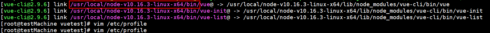
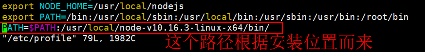

# 安装

### 一、nodejs的安装

　　由于使用vue-cli进行开发需要使用到nodejs，本文以Nodejs的安装开进行开篇。Nodejs的安装有三种方法，这里我们使用二进制包的方式进行安装，并且使用LST版本。其中参考了[Centos7下安装nodejs](https://www.cnblogs.com/evaxtt/p/9542129.html)，此文中有一个观点值得参考[Linux 软件安装到哪里合适，目录详解](https://blog.csdn.net/qq_15766181/article/details/80755786)。

以下是我制作的安装脚本

```shell
#!/bin/bash
# 本脚本用于安装nodejs

# 定义 nodejs的版本
nodejs_ver="v10.16.3"
cd	/usr/local/
wget https://nodejs.org/dist/${nodejs_ver}/node-${nodejs_ver}-linux-x64.tar.xz
tar xf node-${nodejs_ver}-linux-x64.tar.xz
ln -s /usr/local/node-${nodejs_ver}-linux-x64/bin/node /usr/bin/node
ln -s /usr/local/node-${nodejs_ver}-linux-x64/bin/npm /usr/bin/npm
ln -s /usr/local/node-${nodejs_ver}-linux-x64/bin/npm /usr/bin/npx
# 修改npm的镜像源
npm config set registry https://registry.npm.taobao.org
# 安装cnpm 
npm install -g cnpm --registry=https://registry.npm.taobao.org
ln -s /usr/local/node-${nodejs_ver}-linux-x64/bin/cnpm /usr/bin/cnpm
```

在上面的脚本中，本来准备使用cnpm来安装vue-cli的，但是发现安装后的vue是2.0的版本，所以重新配置了npm的国内镜像源。

### 二、安装vue-cli

```shell
npm install -g vue-cli
```

这个过程要等一小会，将会出现如下图所示的安装成功的界面，我们要将vue的路径加入到**/etc/profile**中，否则执行 `vue` 报错 `bash: vue: command not found`



```shell
vim /etc/profile
source /etc/profile
```



